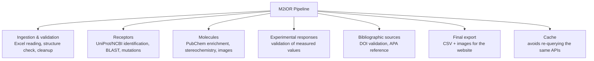

# M2iOR – Data Checking Pipeline

Pipeline that takes the Excel files of scientific studies (olfactory receptors, molecules, responses) as input and produces checked and enriched CSV files for the M2iOR website.

Full file-by-file breakdown: [docs/PIPELINE.md](docs/PIPELINE.md)
