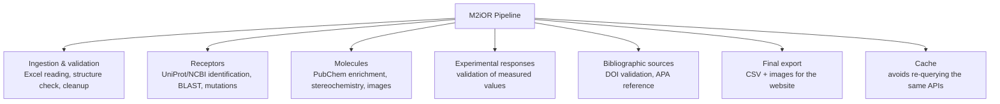

# M2iOR – Data Checking Pipeline

Pipeline that takes the Excel files of scientific studies (olfactory receptors, molecules, responses) as input and produces checked and enriched CSV files for the M2iOR website.



Full file-by-file breakdown: [docs/PIPELINE.md](docs/PIPELINE.md)

## Getting started

### Prerequisites

- Python >= 3.14
- [uv](https://docs.astral.sh/uv/) — the package/dependency manager this project uses

Install uv (one-time, see the [official guide](https://docs.astral.sh/uv/getting-started/installation/) for alternatives):

```bash
curl -LsSf https://astral.sh/uv/install.sh | sh
```

### Installation

From the project root:

```bash
uv sync
```

This creates the `.venv` and installs every dependency pinned in `uv.lock`.

Receptor mutation analysis (`scripts/find_protein_mutations.py`) and the BLAST fallback (`scripts/fetch_blast.py`) require a local BLAST installation:

```bash
./scripts/install_blast.sh
```

### Running the pipeline

All commands are run through `uv run main.py`, so dependencies are resolved automatically without activating the virtual environment manually.

```bash
uv run main.py --status          # Show the processing status of every known study
uv run main.py --scan            # List Excel files, flag new/modified ones, and choose which to process
uv run main.py --pending         # Process every study still pending
uv run main.py --retry           # Retry only studies that previously failed
uv run main.py --all             # Reprocess every study, ignoring DONE/FAILED status
uv run main.py --file <path>     # Process a single Excel file
uv run main.py --force           # Reprocess every study and force BLAST re-queries
uv run main.py --force <path>    # Reprocess a single file and force BLAST re-queries
```

Note: the input directory (Excel studies) and output directory (M2iOR website data) are currently hardcoded as absolute paths at the top of [main.py](main.py) — update `M2IOR_WEB_PUBLIC_PATH` and `input_path` there if you run the pipeline on a different machine.
